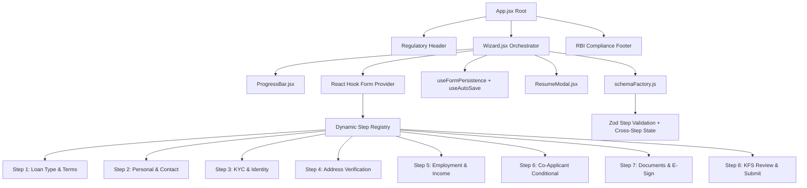
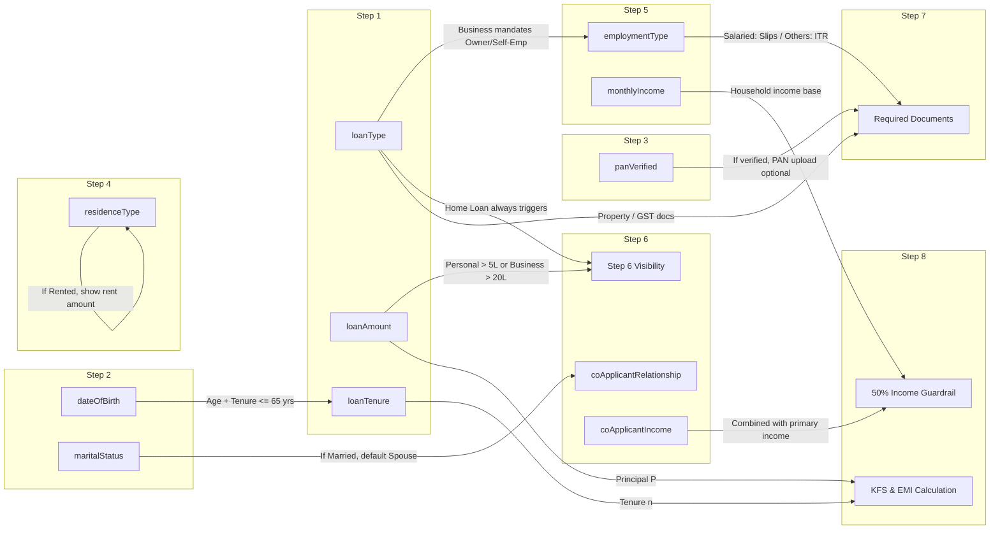
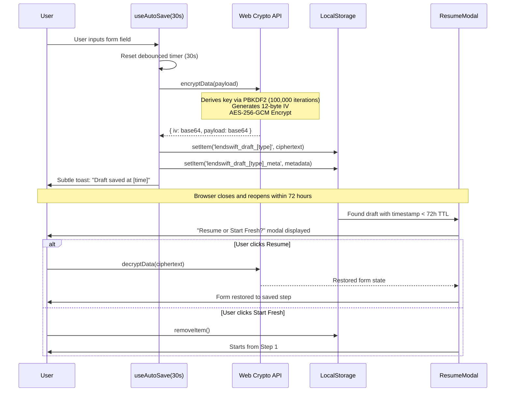
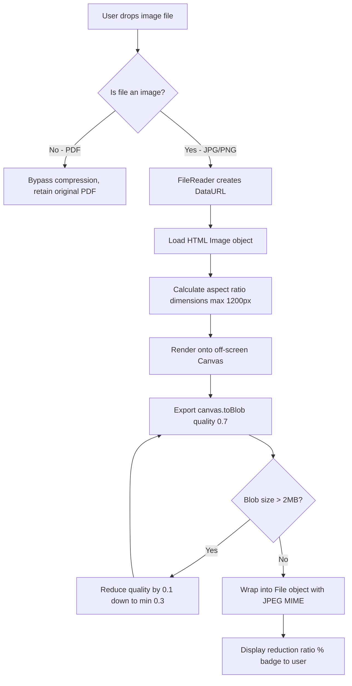

# LendSwift Architecture & Engineering Specification

This document details the architectural decisions, design patterns, security protocols, and state management mechanisms governing the **LendSwift Multi-Step Digital Loan Application**.

---

## 1. High-Level Architectural Patterns

### 1.1 Architectural Pattern Evaluation

| Pattern | Trade-offs | Evaluation for LendSwift |
| :--- | :--- | :--- |
| **Pattern 1: Single Form, Monolithic Schema** | Monolithic schema; any step validation re-runs all 50+ fields. High re-render latency. | **Rejected** due to performance bottlenecks on tier-2/3 low-end mobile devices. |
| **Pattern 2: Step-Per-Form, Isolated Stores** | Reusable steps, but cross-step validation dependencies require complicated manual store syncs. | **Rejected** due to state synchronization bugs (e.g. PhonePe incident referenced in PRD). |
| **Pattern 3: Wizard with Step Registry (Chosen)** | Clean separation of concerns: Wizard handles orchestration and active step calculation; steps handle local UI; central RHF context manages data; dynamic schema factory compiles schemas per step. | **Selected (Optimal)** for 85%+ completion rate and 100% cross-step dependency reliability. |

---

## 2. Dynamic Cross-Step Validation Dependency Graph

LendSwift implements **14 explicit cross-step validation dependencies** as mandated by the PRD.

### Complete Cross-Step Dependency Specification Table

| # | Source Step & Field | Target Step & Behaviour | Technical Implementation |
| :-: | :--- | :--- | :--- |
| **1** | Step 1 (`loanType`) | Step 5 (`employmentType`) | If `loanType === 'business'`, disables `salaried` option in UI and flags Zod error. |
| **2** | Step 1 (`loanType`) | Step 6 (Step Visibility) | If `loanType === 'home'`, `isStep6Required` unconditionally returns `true`. |
| **3** | Step 1 (`loanType`) | Step 7 (`documents`) | Injects `propertyDocs` for Home, or `businessRegistration` & `gstReturns` for Business. |
| **4** | Step 1 (`loanAmount`) | Step 6 (Step Visibility) | Personal `> 5,00,000` or Business `> 20,00,000` inserts Step 6 into `activeSteps`. Exactly 5,00,000 does not trigger. |
| **5** | Step 1 (`loanAmount`) | Step 8 (EMI Calculation) | Serves as Principal ($P$) in reducing balance EMI formula. |
| **6** | Step 1 (`loanTenure`) | Step 8 (EMI Calculation) | Serves as monthly periods ($n$) in EMI formula. |
| **7** | Step 2 (`dateOfBirth`) | Step 1 (`loanTenure`) | Calculates applicant age: $\text{Age} + \text{Tenure} \le 65\text{ years}$. Restricts max tenure options. |
| **8** | Step 2 (`maritalStatus`) | Step 6 (`coApplicantRelationship`) | If `maritalStatus === 'Married'`, defaults relationship dropdown to `Spouse`. |
| **9** | Step 3 (`panVerified`) | Step 7 (`documents.panCard`) | If PAN successfully verified via simulated NSDL check, PAN card document upload is marked optional. |
| **10** | Step 4 (`residenceType`) | Step 4 (`monthlyRent`) | If `residenceType === 'Rented'`, mounts `monthlyRent` input and enforces positive numeric validation. |
| **11** | Step 5 (`employmentType`) | Step 5 (Sub-form Mounting) | Mounts Salaried vs. Self-Employed vs. Business Owner sub-forms. Automatically purges unmounted fields to prevent data leaks. |
| **12** | Step 5 (`employmentType`) | Step 7 (`documents`) | Salaried mandates 3 months salary slips; Self-Employed and Business Owner mandate 2 years ITR. |
| **13** | Step 5 (`monthlyIncome`) | Step 8 (EMI Affordability) | Evaluates $\text{EMI} / \text{Income} \le 50\%$. If $>50\%$, triggers high-risk alert and mandates explicit borrower risk acknowledgement. |
| **14** | Step 6 (`coApplicantIncome`) | Step 8 (Household Affordability) | Added to primary income to calculate combined debt-to-income ratio. |

---

## 3. Cryptographic State Persistence Architecture (AES-256-GCM)

To comply with **RBI Data Protection** principles, sensitive PII (PAN, Aadhaar, salary, residential address) is never stored in plain text in browser storage.

---

## 4. Identity & KYC Algorithms

### 4.1 Aadhaar Verhoeff Checksum Algorithm
Aadhaar numbers are validated using the dihedral group $D_5$ Verhoeff algorithm utilizing three lookup tables:
1. **Multiplication Table ($d$)**: $10 \times 10$ matrix representing permutation multiplication in $D_5$.
2. **Permutation Table ($p$)**: $8 \times 10$ matrix applying position-dependent permutations.
3. **Inverse Table ($inv$)**: Inversion mapping in $D_5$.

A number string $a_n a_{n-1} \dots a_1$ passes if:
$$\sum_{i=1}^{n} d(c, p[i \bmod 8][a_i]) = 0$$
This eliminates 100% of single-digit errors and consecutive transposition errors.

### 4.2 PAN Format & Entity Matching
Indian PAN is defined as `[A-Z]{5}[0-9]{4}[A-Z]{1}`:
- **1st to 3rd characters**: Alphabetic series.
- **4th character**: Entity Category (`P` for Person/Individual, `C` for Company, `F` for Partnership Firm, `H` for HUF, etc.).
- **5th character**: First letter of applicant's surname.
- **6th to 9th characters**: Sequential numeric digits.
- **10th character**: Alphabetic check digit.

*Enforcement*:
- Personal and Home loans: Only `P` is accepted.
- Business loans: `P`, `C`, or `F` are accepted.

---

## 5. Client-Side Image Compression Pipeline

To ensure sub-2.5 second upload speeds on tier-2/3 Indian 4G/3G networks, uploaded images are compressed directly on the client using the **HTML5 Canvas API**:

---

## 6. Financial Computation Engine (Key Fact Statement)

All calculations strictly mirror RBI DL/2022/01 standards using the standard **reducing-balance monthly compounding formula**:

$$\text{EMI} = P \times r \times \frac{(1+r)^n}{(1+r)^n - 1}$$

Where:
- $P$ = Principal Sanction Amount
- $r$ = Monthly interest rate ($\frac{\text{Annual Rate}}{12 \times 100}$)
  - Personal Loan: $10.5\%$ p.a.
  - Home Loan: $8.5\%$ p.a.
  - Business Loan: $14.0\%$ p.a.
- $n$ = Loan tenure in months

### Ancillary Parameters:
- **Total Repayment**: $\text{EMI} \times n$
- **Total Cost of Borrowing (Interest)**: $(\text{EMI} \times n) - P$
- **Processing Fee**: $1\%$ of $P$, bounded by $[\text{₹ }2,000, \text{₹ }25,000]$
- **Net Disbursal**: $P - \text{Processing Fee}$
- **Debt-to-Income (DTI) Ratio**: $\frac{\text{EMI}}{\text{Verified Household Income}} \times 100$
  - If $\text{DTI} > 50\%$, system triggers high-risk financial warning and mandates explicit borrower risk acknowledgement.

---

## 7. Accessibility Architecture (WCAG 2.1 AA)

1. **Focus Order Management**: A dedicated `useEffect` in `Wizard.jsx` queries the newly mounted step's DOM tree and automatically places keyboard focus onto the first interactive element.
2. **Screen Reader Notification**: All status updates (e.g. file upload compression, draft save timestamps, validation banners) are mirrored to assistive technology via `aria-live="polite"` and `role="alert"`.
3. **Contrast Compliance**: Form borders, text elements, and buttons strictly adhere to 4.5:1 text and 3:1 non-text contrast ratios.
4. **Touch Target Dimensions**: All clickable controls (`button`, `select`, `input`, `checkbox`) enforce a minimum dimension of `44x44px` via Tailwind's `min-h-touch`.
